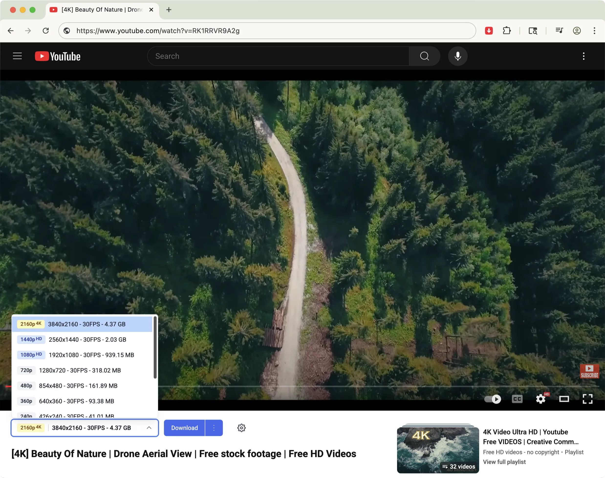
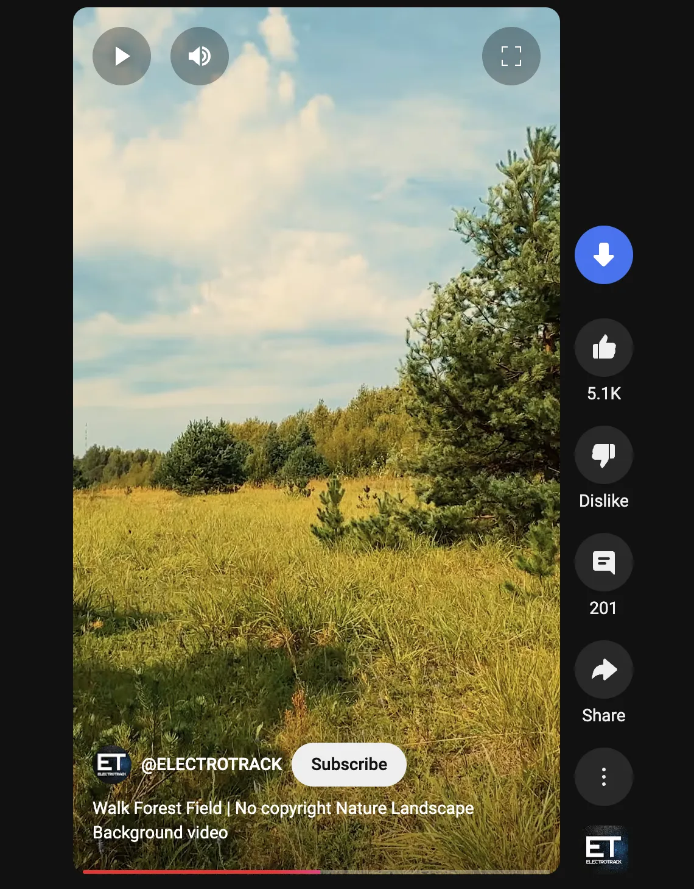

# Tubly Downloader - YouTube Downloader Chrome Extension

  

<h3 align="center">Download YouTube videos in 4K, convert to MP3, and save YouTube Shorts</h3>

  
  &nbsp;&nbsp;
  

  <a href="https://github.com/tublydownloader/Youtube-Downloader-Extension/issues/new/choose">🐛 Report Issue</a> •
  <a href="https://tubly.download">🌐 Official Website</a>

  <a href="#key-features">Key Features</a> •
  <a href="#screenshots">Screenshots</a> •
  <a href="#installation">Installation</a> •
  <a href="#faq">FAQ</a>

## Key Features

- **4K Video Downloads**: Download YouTube videos in ultra HD quality
- **YouTube to MP3 Converter**: Convert YouTube videos to high-quality 320kbps MP3 audio
- **YouTube Shorts**: Save Shorts videos with one click
- **No Ads, No Extra Software**: Clean and straightforward downloading experience
- **Cross-Platform**: Works on Windows, macOS, and Linux with Chrome, Edge, Firefox, Opera, Brave, and Vivaldi
- **Private Video Support**: Download private videos and member-only content you have access to

## Screenshots

  <video src="https://github.com/user-attachments/assets/cda9caef-f238-4c41-a283-a7988ea34723" width="600" alt="YouTube Downloader demo video">

  

  

## Installation

### Chrome, Brave, Opera, and Vivaldi
For detailed installation instructions on Chromium-based browsers, visit our [official website](https://tubly.download/install.html).

### Microsoft Edge
1. Visit our [Edge Add-ons page](https://microsoftedge.microsoft.com/addons/detail/npolimekdjdhijlfikfghaipaijbbobj)
2. Click "Get" to add the extension
3. Follow the prompts to complete installation

### Firefox
1. Download our [Firefox add-on xpi package](https://tubly.download/firefox/tubly_downloader_v1.4.5.xpi)
2. Firefox will automatically start the installation process
3. Follow the prompts to complete installation

### Updating
> Edge & Firefox users get updates automatically.
1. For Chrome users, download the new version from our website
2. Follow the same installation steps with the new file
3. Your settings will be preserved automatically

## FAQ

### How do I download YouTube videos in 4K quality?
Simply navigate to any YouTube video, and click the download button that appears below the video player. You'll be presented with multiple quality options, including 4K (2160p) and even 8K if available.

### Can I download YouTube Shorts videos?
Yes! Our Chrome extension is specially designed to detect and download YouTube Shorts. When viewing Shorts content, you'll see our download button appear, allowing you to save these short-form videos directly to your device.

### How to convert YouTube videos to MP3?
Our extension extracts audio directly from videos without requiring any additional software. After installing, you'll see an "Audio" option when clicking the download button to save in high-quality 320kbps MP3 format.

